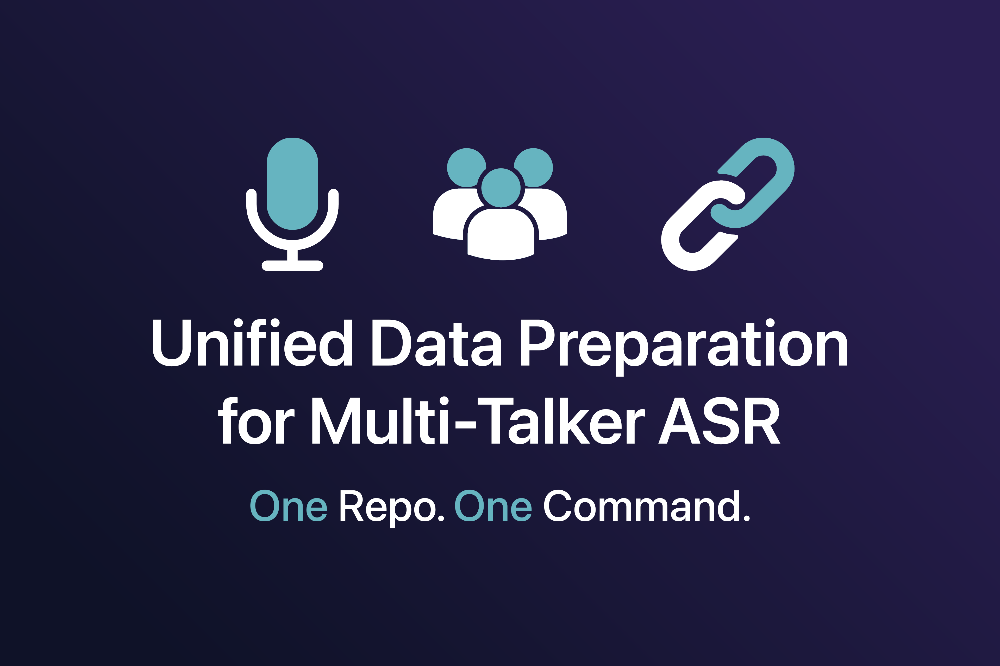

# Unified Data Preparation for Multi-Talker ASR  



> **One repo. One command. Ready-to-train datasets for multi-talker ASR.**  
> Streamline data prep with reproducible manifests, benchmark-ready cutsets, and automatic dependency handling — all aligned with **BUT-FIT DiCoW** models.

---

## ✨ Highlights
- Unified CLI for **single-mic** and **multi-mic** datasets  
- **Reproducible & sharable** manifests and cutsets (via [Lhotse](https://github.com/lhotse-speech/lhotse))  
- Automatic handling of nested dataset dependencies  
- Standardized benchmark exports for **single- & multi-channel evaluation**  
- Optional **30s windowed cuts** for Whisper / DiCoW training  

---

## 📊 Official Benchmark
**[EMMA Leaderboard](https://huggingface.co/spaces/BUT-FIT/EMMA_leaderboard)**  
Official JSALT 2025 benchmark built directly on cutsets from this repo.  

---

## 🧩 Pretrained Models
- [DiCoW v3.2 (best-performing to date)](https://huggingface.co/BUT-FIT/DiCoW_v3_2)  

---

## 📚 Supported Datasets
**Single-mic**: `librispeech`, `librimix`, `librispeechmix`, `ali_meeting-sdm`, `ami-sdm`, `ami-ihm-mix`, `notsofar1-sdm`  
**Multi-mic**: `aishell4`, `ali_meeting-mdm`, `ami-mdm`, `notsofar1-mdm` 

---

## ⚡ Quickstart
**Requirements**: Python 3.9+, `lhotse`, `huggingface-hub` (only for NOTSOFAR-1), `sox` (AliMeeting)
```bash
pip install -r requirements.txt
````
If you are preparing NOTSOFAR-1 as well, you need to first setup a HuggingFace token ([Tutorial Link](https://huggingface.co/docs/hub/en/security-tokens)) and then export it in your environment:
```bash
export HF_TOKEN="{YOUR HF TOKEN}"
```
If the download fails, run the preparation of NOTSOFAR-1 dataset alone multiple times until the download succeeds: `./prepare -d notsofar1-sdm,notsofar1-mdm`.

**Prepare selected datasets**:

```bash
./prepare.sh --datasets notsofar1-sdm,ami-sdm --root-dir /path/to/workdir
```

**Prepare all single-mic datasets**:

```bash
./prepare.sh --single-mic-only --root-dir /path/to/workdir
```

---

## 📂 Outputs

* **Manifests** → `manifests/<dataset>/*.jsonl.gz`
* **30s cutsets** → e.g. `manifests/librimix/librimix_cutset_*_30s.jsonl.gz`

---

## 🗂 Repository Layout

* Orchestration scripts → `prepare.sh`, `prepare_single_mic.sh`, `prepare_multi_mic.sh`
* Dataset runners → `dataset_scripts/prepare_*.sh`
* Utilities → `src/*.py`

---

## 💬 Contact
If you have further questions or interest in our other work, contact us: [ipoloka@fit.vut.cz](mailto:ipoloka@fit.vut.cz), [iklement@fit.vutbr.cz](mailto:iklement@fit.vutbr.cz).

---

## 📖 Citation & License

* Cite the original datasets + [Lhotse](https://github.com/lhotse-speech/lhotse)
* Respect dataset licenses

If this repo, its cutsets, or the evaluation protocol were useful, please also cite **DiCoW**:

```bibtex
@article{POLOK2026101841,
title = {{DiCoW}: Diarization-conditioned {Whisper} for target speaker automatic speech recognition},
journal = {Computer Speech \& Language},
volume = {95},
pages = {101841},
year = {2026},
doi = {10.1016/j.csl.2025.101841},
author = {Alexander Polok and Dominik Klement and Martin Kocour and Jiangyu Han and Federico Landini and Bolaji Yusuf and Matthew Wiesner and Sanjeev Khudanpur and Jan Černocký and Lukáš Burget}
}
```
